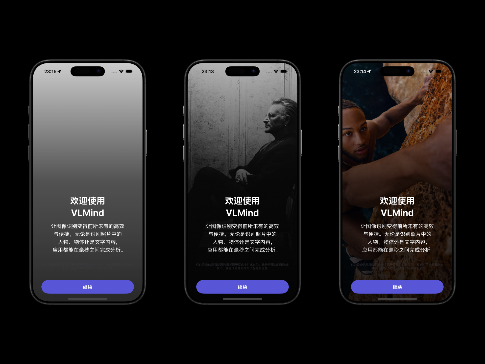

# WSOnBoarding

基于纯SwiftUI构建，通过一行代码为应用添加符合Apple设计规范的欢迎页面。

## 核心亮点

- 纯SwiftUI实现，支持iOS/iPadOS/macOS
- 一行代码集成
- 自动管理显示逻辑
- 跨设备同步（即将推出）


## 安装

### 通过 Swift Package Manager 安装

在 Xcode 中添加依赖项：
1. 选择菜单 `File` > `Add Packages...`
2. 输入仓库URL：`https://github.com/Jewel591/WSOnBoarding`
3. 保持默认选项，点击完成。

## 使用

### 基本用法（最佳实践）

为了更好地组织代码，我强烈建议创建一个独立的文件，专门用于设置用于欢迎页面显示的信息：

#### 1. 创建配置文件

> *你可以直接将下面这个模板文件复制到你的 Xcode 项目中。我一般会放在 OnBoarding 目录下。*

```swift
// WelcomeConfig.swift
import SwiftUI
import WSOnBoarding

// 扩展 WSOnBoarding 库中的 WSWelcomeConfig
extension WSWelcomeConfig {
    /// 应用的欢迎页配置
    static var welcomeInfo: WSWelcomeConfig {
        return WSWelcomeConfig(
            appName: "VLMind", // 显示的应用名称
            introText: nil,
            features: [
                FeatureItem(
                    icon: "photo.on.rectangle",
                    title: "视觉识别",
                    description: "选取并识别图像中的内容。",
                    color: .blue
                ),
                FeatureItem(
                    icon: "bolt.fill",
                    title: "毫秒级响应",
                    description: "超快速分析，无需等待即可获得结果。",
                    color: .orange
                ),
                FeatureItem(
                    icon: "wifi.slash",
                    title: "离线支持",
                    description: "无需联网，在本地设备上完成所有处理。",
                    color: .green
                ),
            ],
            iconSymbol: "camera.viewfinder",
            iconName: "AppIcon", // 应用图标图片文件名称
            backgroundImageName: nil,
            primaryColor: .blue,
            continueButtonText: "继续",
            disclaimerText:
                "你的设备信息和使用数据将用于提供个性化体验、改进应用功能和防止欺诈。查看详细隐私政策了解更多信息。"
        )
    }
}
```

#### 2. 在 App 文件中应用

首先，在 App 文件中导入 `WSOnBoarding`：

```
import WSOnBoarding
```

然后在 WindowGroup 的 View 组件上添加 `.wsWelcomeView`修饰器：

```swift
// YourApp.swift
import SwiftUI
import WSOnBoarding

@main
struct YourApp: App {
    var body: some Scene {
        WindowGroup {
            ContentView()
                .wsWelcomeView(
                    config: WSWelcomeConfig.welcomeInfo, // 要显示的应用信息
                    style: .standard // 预设的外观风格（.standard 或 .immersive）
                )
        }
    }
}
```

至此，就完成了所有配置工作，wsWelcomeView 会自动管理显示逻辑（默认仅显示一次）。当然，默认支持深色模式。


## 设置显示图标

`.wsWelcomeView()` 支持通过 `iconName` 或 `iconSymbol` 参数设置显示的图标。

`iconName` 的优先级高于`iconSymbol`。

### 使用 App 应用图标

1. 在项目的 Assets 中添加 App 图标图片（例如 AppIcon）

2. 在 WelcomeConfig.swift 文件中，设置 `iconName`

```swift
iconName: "AppIcon", // 应用图标图片文件名称
```

### 使用 SF 符号

通过设置 `iconSymbol` 参数，提供 SF 符号名称。

```swift
iconSymbol: "camera.viewfinder"
```

### 设置图标颜色

通过设置 `primaryColor` 参数，提供 Color。

```swift
primaryColor: .blue
```

`primaryColor` 会影响底部 Button 和顶部图标的颜色，它们总是使用相同的颜色。


## 设置描述内容

通过 introText 参数，可以设置用于显示的描述内容。

```swift
introText:"所有处理均在本地完成，无需网络连接，确保在任何环境下都能稳定运行。",
```


## 设置功能亮点

### 带图标的列表

通过 features 参数，设置要显示的功能列表。

```swift
features: [
    FeatureItem(
        icon: "photo.on.rectangle",
        title: "视觉识别",
        description: "选取并识别图像中的内容。",
        color: .blue
    ),
    FeatureItem(
        icon: "bolt.fill",
        title: "毫秒级响应",
        description: "超快速分析，无需等待即可获得结果。",
        color: .orange
    ),
    FeatureItem(
        icon: "wifi.slash",
        title: "离线支持",
        description: "无需联网，在本地设备上完成所有处理。",
        color: .green
    ),
],
```

### 不显示图标

如果不显示图标，将 `icon` 设置为 `nil` 。

```swift
FeatureItem(
    icon: nil,
    title: "视觉识别",
    description: "选取并识别图像中的内容。",
    color: .blue
),
```

### 不使用列表

如果 features 只有一个 FeatureItem，将自动隐藏 icon 和 title，仅显示 description。并自定居中显示。

通过 `\n` 实现换行。

```
features: [
    FeatureItem(
        icon: "photo.on.rectangle",
        title: "视觉识别",
        description: "让图像识别变得前所未有的高效与便捷。无论是识别照片中的人物、物体还是文字内容，应用都能在毫秒之间完成分析。所有处理均在本地完成，无需网络连接，既保障隐私，又确保在任何环境下都能稳定运行。\n\n立即体验 VLMind，让视觉感知成为你的得力助手。",
        color: .blue
    ),
]
```


## 设置页面样式

通过 style 参数，选择预设的样式。

### standard 模式

标准样式适合展示多个功能亮点。

```swift
// 标准样式（默认）- 白底，图标+功能列表
.wsWelcomeView(
    config: WSWelcomeConfig.welcomeInfo,
    style: .standard  // 默认值，可省略
)

// 沉浸式样式 - 全屏背景图片，底部描述
.wsWelcomeView(
    config: WSWelcomeConfig.welcomeInfo,
    style: .immersive
)
```

### immersive 模式

沉浸式样式，适合创建视觉冲击力更强的欢迎页面，仅显示少量信息。

在 immersive 模式下，可以通过 backgroundImageName 参数设置背景图片。

```swift
 backgroundImageName: "welcomeBackgroundImage", // 在 Assets 中添加图片
```



## 重置显示状态

.wsWelcomeView 通过 `welcomeKey` 判断显示状态。

如果在新版本中希望重置显示状态，更新 `welcomeKey` 为其他任意值即可。

```swift
// 使用自定义键控制显示逻辑
.wsWelcomeView(
    config: myConfig,
    welcomeKey: "customWelcomeKey"  
)
```

## 系统要求

- iOS 15.0+
- iPadOS 15.0+
- macOS 12.0+
- Swift 5.5+
- Xcode 13.0+

## 参数说明

`WSWelcomeConfig`提供多种配置选项来自定义欢迎页面：

### 基本配置

| 参数 | 类型 | 描述 |
|------|------|------|
| appName | String | 应用名称 |
| introText | String? | 介绍文本，显示在标题下方 |
| features | [FeatureItem] | 功能项数组 |
| customTitle | String? | 自定义标题，默认为"欢迎使用{appName}" |

### 图标配置

| 参数 | 类型 | 描述 |
|------|------|------|
| iconName | String? | Assets中的图标名称 (优先) |
| iconSymbol | String? | SF Symbol图标名称 |

### 样式配置

| 参数 | 类型 | 描述 |
|------|------|------|
| primaryColor | Color | 主要颜色，用于按钮等 |
| secondaryColor | Color | 次要颜色，用于默认图标背景 |

### 文本与隐私配置

| 参数 | 类型 | 描述 |
|------|------|------|
| continueButtonText | String | 继续按钮文字 |
| disclaimerText | String? | 底部声明文本 |
| privacyButtonText | String? | 隐私政策按钮文字 |
| privacyAction | (() -> Void)? | 点击隐私政策的回调 |

## 许可证

MIT License 