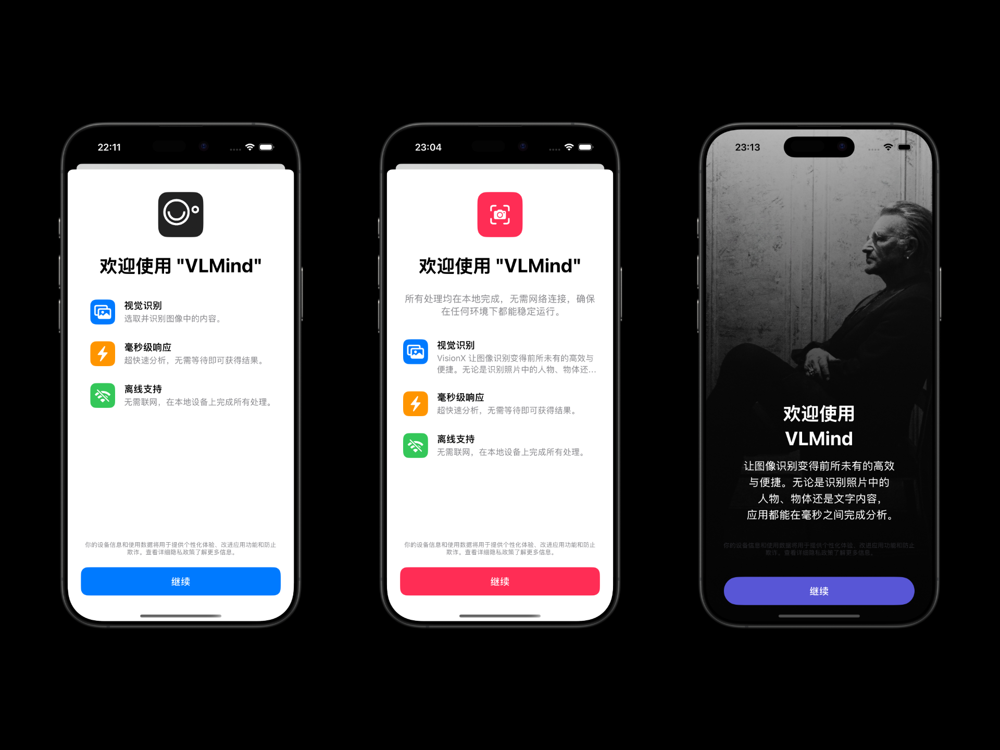
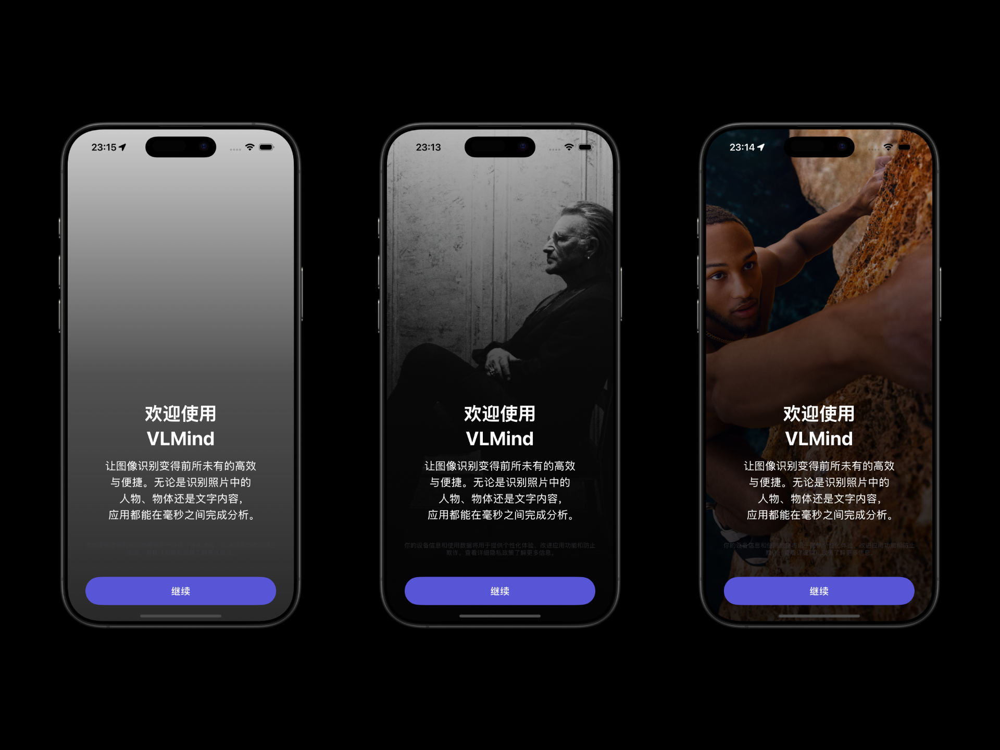

# WSOnBoarding

[](README.md) [](README_EN.md)

Built with pure SwiftUI, add an Apple design-compliant welcome page to your app with just one line of code.

## Key Features

- Pure SwiftUI implementation, supporting iOS/iPadOS/macOS
- Single line of code integration
- Automatic display management
- Cross-device synchronization (coming soon)



## Installation

### Via Swift Package Manager

Add the dependency in Xcode:
1. Select menu `File` > `Add Packages...`
2. Enter repository URL: `https://github.com/Jewel591/WSOnBoarding`
3. Keep default options and click finish.

## Usage

### Basic Usage (Best Practice)

For better code organization, I strongly recommend creating a separate file dedicated to welcome page information settings:

#### 1. Create Configuration File

> *You can copy this template file directly into your Xcode project. I usually place it in the OnBoarding directory.*

```swift
// WelcomeConfig.swift
import SwiftUI
import WSOnBoarding

// Extend WSWelcomeConfig from WSOnBoarding library
extension WSWelcomeConfig {
    /// App welcome page configuration
    static var welcomeInfo: WSWelcomeConfig {
        return WSWelcomeConfig(
            appName: "VLMind", // App name to display
            introText: nil,
            features: [
                FeatureItem(
                    icon: "photo.on.rectangle",
                    title: "Visual Recognition",
                    description: "Select and recognize content in images.",
                    color: .blue
                ),
                FeatureItem(
                    icon: "bolt.fill",
                    title: "Millisecond Response",
                    description: "Ultra-fast analysis, get results without waiting.",
                    color: .orange
                ),
                FeatureItem(
                    icon: "wifi.slash",
                    title: "Offline Support",
                    description: "No internet needed, all processing happens on your device.",
                    color: .green
                ),
            ],
            iconSymbol: "camera.viewfinder",
            iconName: "AppIcon", // App icon image file name
            backgroundImageName: nil,
            primaryColor: .blue,
            continueButtonText: "Continue",
            disclaimerText:
                "Your device information and usage data will be used to provide a personalized experience, improve app functionality, and prevent fraud. See detailed privacy policy for more information."
        )
    }
}
```

#### 2. Apply in App File

First, import `WSOnBoarding` in your App file:

```
import WSOnBoarding
```

Then add the `.wsWelcomeView` modifier to the View in WindowGroup:

```swift
// YourApp.swift
import SwiftUI
import WSOnBoarding

@main
struct YourApp: App {
    var body: some Scene {
        WindowGroup {
            ContentView()
                .wsWelcomeView(
                    config: WSWelcomeConfig.welcomeInfo, // App info to display
                    style: .standard // Preset appearance style (.standard or .immersive)
                )
        }
    }
}
```

With this, all configuration is complete. wsWelcomeView will automatically manage display logic (default: display only once). Dark mode is supported by default.


## Setting Display Icon

`.wsWelcomeView()` supports setting the display icon via `iconName` or `iconSymbol` parameters.

`iconName` has higher priority than `iconSymbol`.

### Using App Icon

1. Add the app icon image in your project's Assets (e.g., AppIcon)

2. In the WelcomeConfig.swift file, set `iconName`

```swift
iconName: "AppIcon", // App icon image file name
```

### Using SF Symbols

Set the `iconSymbol` parameter with an SF Symbol name.

```swift
iconSymbol: "camera.viewfinder"
```

### Setting Icon Color

Provide a Color by setting the `primaryColor` parameter.

```swift
primaryColor: .blue
```

`primaryColor` affects both the bottom button and top icon color - they always use the same color.


## Setting Description Content

Set the description content to display using the introText parameter.

```swift
introText: "All processing is done locally without internet connection, ensuring stable operation in any environment.",
```


## Setting Feature Highlights

### List with Icons

Set the feature list to display using the features parameter.

```swift
features: [
    FeatureItem(
        icon: "photo.on.rectangle",
        title: "Visual Recognition",
        description: "Select and recognize content in images.",
        color: .blue
    ),
    FeatureItem(
        icon: "bolt.fill",
        title: "Millisecond Response",
        description: "Ultra-fast analysis, get results without waiting.",
        color: .orange
    ),
    FeatureItem(
        icon: "wifi.slash",
        title: "Offline Support",
        description: "No internet needed, all processing happens on your device.",
        color: .green
    ),
],
```

### Hide Icons

To hide icons, set `icon` to `nil`.

```swift
FeatureItem(
    icon: nil,
    title: "Visual Recognition",
    description: "Select and recognize content in images.",
    color: .blue
),
```

### Without List

If features contains only one FeatureItem, the icon and title will be automatically hidden, displaying only the description centered.

Use `\n` for line breaks.

```
features: [
    FeatureItem(
        icon: "photo.on.rectangle",
        title: "Visual Recognition",
        description: "Make image recognition more efficient and convenient than ever before. Whether recognizing people, objects, or text in photos, the app completes analysis in milliseconds. All processing is done locally without internet connection, protecting privacy and ensuring stable operation in any environment.\n\nExperience VLMind now and make visual perception your powerful assistant.",
        color: .blue
    ),
]
```


## Setting Page Style

Choose a preset style using the style parameter.

### standard Mode

Standard style is suitable for displaying multiple feature highlights.

```swift
// Standard style (default) - White background, icon + feature list
.wsWelcomeView(
    config: WSWelcomeConfig.welcomeInfo,
    style: .standard  // Default value, can be omitted
)

// Immersive style - Full-screen background image, bottom description
.wsWelcomeView(
    config: WSWelcomeConfig.welcomeInfo,
    style: .immersive
)
```

### immersive Mode

Immersive style is suitable for creating welcome pages with stronger visual impact, displaying minimal information.

In immersive mode, you can set a background image using the backgroundImageName parameter.

```swift
backgroundImageName: "welcomeBackgroundImage", // Add image in Assets
```



## Resetting Display State

.wsWelcomeView uses `welcomeKey` to determine display state.

If you want to reset the display state in a new version, update `welcomeKey` to any other value.

```swift
// Use a custom key to control display logic
.wsWelcomeView(
    config: myConfig,
    welcomeKey: "customWelcomeKey"  
)
```

## System Requirements

- iOS 15.0+
- iPadOS 15.0+
- macOS 12.0+
- Swift 5.5+
- Xcode 13.0+

## Parameter Reference

`WSWelcomeConfig` provides multiple configuration options to customize the welcome page:

### Basic Configuration

| Parameter | Type | Description |
|------|------|------|
| appName | String | Application name |
| introText | String? | Introduction text, displayed below the title |
| features | [FeatureItem] | Feature items array |
| customTitle | String? | Custom title, default is "Welcome to {appName}" |

### Icon Configuration

| Parameter | Type | Description |
|------|------|------|
| iconName | String? | Icon name in Assets (priority) |
| iconSymbol | String? | SF Symbol name |

### Style Configuration

| Parameter | Type | Description |
|------|------|------|
| primaryColor | Color | Primary color, used for buttons etc. |
| secondaryColor | Color | Secondary color, used for default icon background |

### Text and Privacy Configuration

| Parameter | Type | Description |
|------|------|------|
| continueButtonText | String | Continue button text |
| disclaimerText | String? | Bottom disclaimer text |
| privacyButtonText | String? | Privacy policy button text |
| privacyAction | (() -> Void)? | Privacy policy click callback |

## License

MIT License 